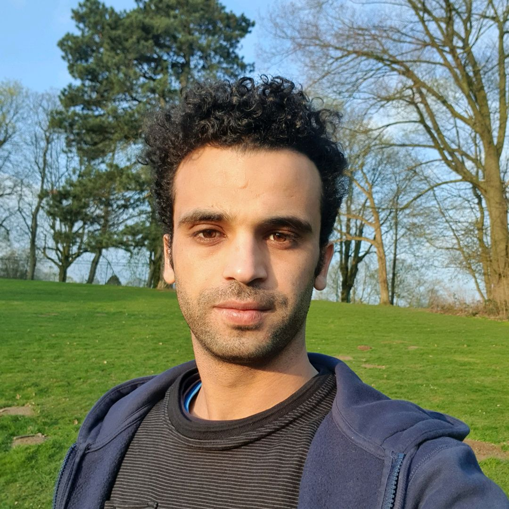

<figure markdown>
  { width="20%" }
</figure>

### **Samir Romdhani**, Full Stack Developer | Open Source Enthusiast

With experience in software development, graduated from National School of Computer Science, based in Paris. 
I'm passionate about technology, my experience extends to technical architecture and product development. Find out more about my experience and publications in my portfolio.

My major focus is on JAVA, Angular, full-stack development and I still keep an eye out for the DevOps and GitOps approachs, docker platform, Kubernetes and tools that manage any cloud, infrastructure, or service mainly Terraform.

In my spare time, I like to write, on Open Source projects such as kubernetes, as well as work on all sorts of experimental development projects.
